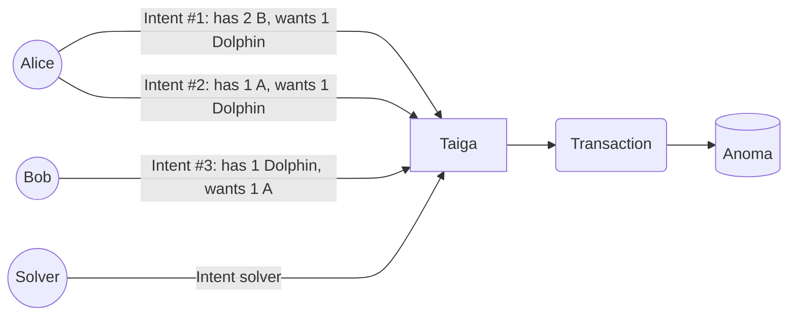
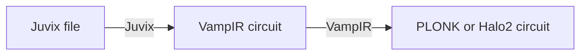

# **Juvix** a language for *intent-centric* and *declarative decentralized* applications

<div class="grid cards" markdown>

<div style="text-align:center" markdown>

<div style="text-align:center">
  
</div>

[Install Juvix on your machine](http://localhost:8000/howto/installing/#shell-script){ .md-button .md-button--primary}

[:fontawesome-regular-circle-dot:{ .heart }  Try Juvix now on Codespaces](https://github.com/codespaces/new?hide_repo_select=true&ref=main&repo=102404734&machine=standardLinux32gb&location=WestEurope){ .md-button  }

</div>

<div markdown>

Juvix is an open-source functional language with static typing and strict
semantics. It is the programming language for the [Anoma][anoma]'s blockchain. The
primary purpose of this language is to encode [Anoma's intents][anoma], enabling
private and transparent execution through [Taiga][taiga] on the Anoma
blockchain.

Juvix, initially designed for Anoma, provides features typical of any high-level
programming language with many more on the horizon. It can compile programs into
native executable, WASM, and arithmetic circuits using [VampIR][vampir] or
[Geb][geb], facilitating zero-knowledge proofs.

Stay tuned for Juvix updates! Follow us on [:material-twitter: Twitter][twitter]
and join our [:fontawesome-brands-discord: Discord][Discord] community.

<!-- To follow the development of Anoma, follow [:material-twitter: Anoma
Twitter][anomaTwitter] and join [:fontawesome-brands-discord: Anoma
Discord][anomaDiscord]. -->

</div>

</div>

<div style="text-align:center" markdown>

## ... a brief of what Juvix is about

</div>


<div class="grid cards" markdown>

<div markdown>

## :material-content-duplicate: Intents in Juvix for Anoma's dApps

What is an [intent](https://anoma.net/blog/intents-arent-real)? An intent, in
essence, is a high-level description of a user's desired transaction. It can be
written in Juvix as a program detailing the conditions that validate the
transaction in relation to the user's resources.

Take for instance, Alice's intent. Her intent is to trade either two units of
resource `B` or one unit of resource `A` for a unit of `Dolphin`. Bob, on the other
hand, is willing to exchange one unit of resource `A` for 1 `Dolphin`. How can we
write these intents in Juvix? The conditions for Alice's intent is presented in
Juvix on the right, a **logic function** that validates the transaction.

See [here](https://anoma.github.io/taiga-simulator/Apps.TwoPartyExchange-src.html#1184) the full Juvix code for this example.

<div class="grid cards" style="text-align:center" markdown>



</div>

How to write intents in Juvix to validate transactions in Anoma is further
elaborated in both the [Taiga
Simulator](https://github.com/anoma/taiga-simulator) repository and the [Juvix
Workshop](https://github.com/anoma/juvix-workshop).

</div>

<div markdown>

## :octicons-mark-github-16: [`anoma/taiga-simulator`](https://github.com/anoma/taiga-simulator)


=== "Partial transactions"

    ```juvix
    --8<------ "docs/index/IntentExample.juvix:partialTxs"
    ```

=== "Alice Intent"

    ```juvix
    --8<------ "docs/index/IntentExample.juvix:aliceIntent"
    ```

=== "Logics"

    ```juvix
    --8<------ "docs/index/IntentExample.juvix:logics"
    ```

!!!info "Note"

    See also the Sudoku intent example: [here](https://anoma.github.io/taiga-simulator/Apps.Sudoku.html#).

</div>
</div>


<div class="grid cards" markdown>

<div markdown>

## :material-graph-outline: Arithmetic Circuits / Zero-knowledge Proofs

An arithmetic circuit is an algebraic representation, essentially expressing a
system of polynomial equations in a universal, canonical form that model the
computation of a program. Arithmetic circuits are used in zero-knowledge proofs
and Juvix can compile programs into these representations via our in-house
compiler [VampIR][vampir].



``` shell
juvix compile -t vampir Hash.juvix
```

The VampIR file can then be compiled to a PLONK circuit:

``` shell
vamp-ir plonk setup -m 14 -o input.pp
vamp-ir plonk compile -u input.pp -s Hash.pir -o c.plonk
```

A zero-knowledge proof that `hash 1367` is equal to `3` can then be generated
from the circuit:

``` shell
vamp-ir plonk prove -u input.pp \
                    -c c.plonk \
                    -o proof.plonk -i Hash.json
```

This proof can then be verified:

``` shell
vamp-ir plonk verify -u input.pp -c c.plonk -p proof.plonk
```

</div>

<div markdown>

## :octicons-mark-github-16: [`anoma/juvix-workshop`](https://github.com/anoma/juvix-workshop/blob/main/arithmetic-circuits/README.md)

=== "Hash.juvix"

    ```juvix
    --8<------ "docs/index/Hash.juvix:hash"
    ```

=== "Hash.json"

    ```juvix
    --8<------ "docs/index/Hash.json"
    ```


!!!info "Note"

    For further details, refer to [Compiling Juvix programs to arithmetic circuits
    via Vamp-IR](./blog/posts/vampir-circuits.md).

</div>

</div>

<div style="text-align:center" markdown>

## :material-firework: Juvix is growing fast!

</div>

<div class="grid cards" markdown>

-   :fontawesome-solid-computer:{ .lg .middle } __How-to guides__

    ---

    Learn how to [install Juvix](./howto/installing.md) on macOS or Linux, as well as compile and
   document your Juvix projects.

    [:octicons-arrow-right-24: Quick start ](./howto/quick-start.md)

    [:octicons-arrow-right-24: How-to guides ](./howto/installing.md)

-   :material-clock-fast:{ .lg .middle } __Tutorials__

    ---

    Master the essentials of Juvix through a series of
    tailored examples, tutorials and technical explanations.

    [:octicons-arrow-right-24: Learn Juvix in 5 minutes](./tutorials/learn.md)

<!-- -  :fontawesome-solid-book-open:{ .lg .middle } __Explanations__

    ---

    A series dedicated to delivering more in-depth technical explanations of Juvix.

    [:octicons-arrow-right-24: Read the book](./explanations/README.md) -->

-  :fontawesome-solid-video:{ .lg .middle } __Talks and Workshops__

    ---

    A collection of talks and workshop videos showcasing Juvix. Gain valuable
    insights and inspiration from our presentations at various conferences.

    [:octicons-arrow-right-24: Juvix videos](./about/talks.md)

-   :fontawesome-solid-lines-leaning:{ .lg .middle } __Reference__

    ---

    Explore the Language reference, milestone examples, and tooling
    documentation!

    [:octicons-arrow-right-24: Reference](./reference/language/functions.md)

-   :material-account-group:{ .lg .middle } __Blog__

    ---

    Check out our blog to discover new features in the upcoming release, along
    with helpful examples and more. And, don't forget to join us on [Discord].

    [:octicons-arrow-right-24: Blog](./blog/index.md)

    [:octicons-arrow-right-24: Join us](./about/community.md)

-   :material-scale-balance:{ .lg .middle } __Open Source, GPL3.0__

    ---

    Juvix is licensed under GPL3 and available on [GitHub].

    [:octicons-arrow-right-24: License](./about/license.md)

</div>


[anoma]: https://anoma.net
[changelog]: https://docs.juvix.org/changelog.html
[Discord]: https://discord.gg/jwzaMZ2Sct
[anomaDiscord]: https://discord.gg/jwzaMZ2Sct
[geb]: https://github.com/anoma/geb
[GitHub]: https://github.com/anoma/juvix
[homebrew]: https://brew.sh
[juvix-book]: https://docs.juvix.org
[juvix-formula]: https://github.com/anoma/homebrew-juvix
[juvix-mode]: https://github.com/anoma/juvix-mode
[latest-release]: https://github.com/anoma/juvix/releases/latest
[nightly-builds]: https://github.com/anoma/juvix-nightly-builds
[repo-codespace]: https://github.com/codespaces/new?hide_repo_select=true&ref=main&repo=102404734&machine=standardLinux32gb&location=WestEurope
[repo]: https://github.com/anoma/juvix
[stdlib-codespace]: https://github.com/codespaces/new?hide_repo_select=true&ref=main&repo=102404734&machine=standardLinux32gb&location=WestEurope
[stdlib]: https://github.com/anoma/juvix-stdlib
[taiga]: https://github.com/anoma/taiga
[twitter]: https://twitter.com/juvixlang
[anomaTwitter]: https://twitter.com/anoma
[vampir]: https://github.com/anoma/vamp-ir
[vscode-plugin]: https://github.com/anoma/vscode-juvix
[website]: https://juvix.org
